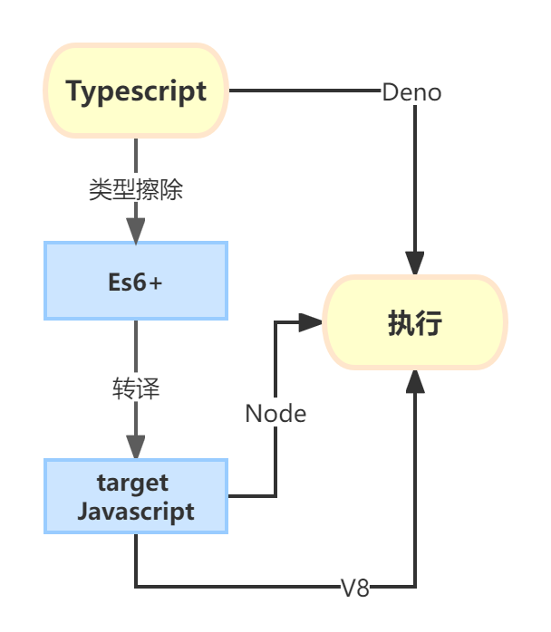

# Typescript 工具链


`Typescript`的执行大部分情况下都需要进行`compiler`,即从一种语言转化到另一种语言。因此`Ts`也衍生出了很多不同的编译器。



## 最近流行的编译器

### [`esbuild`](https://esbuild.github.io/content-types/#typescript)

> esbuild does not do any type checking so you will still need to run` tsc -noEmit` in parallel with esbuild to check types. 

根据文档描述可知，`esbuild`本身不做类型检测，只是进行类型擦除，并指明应该并行运行`tsc`以确保代码的质量可控.

[`tsx loader`](https://github.com/esbuild-kit/tsx) 支持执行`TS`代码.

```bath

tsx ./file.ts

```

### [`swc`](https://swc.rs/)

> SWC can be used for both compilation and bundling. For compilation, it takes JavaScript / TypeScript files using modern JavaScript features and outputs valid code that is supported by all major browsers.

> SWC is 20x faster than Babel on a single thread and 70x faster on four cores.

> Swc can also compile typescript / tsx to ecmascript. Note that it does not type-check at the time of writing. Type checking is tracked at #126.

`swc`可谓是新时代的产品。基于目前流行的`Rust`。不过目前`swc`还是不支持类型检查的，关于为什么不支持，以及作者想法的变化的详细信息，可以参考[`#126`](https://github.com/swc-project/swc/issues/126)

```bath

swc ./file.ts


```

### [`tsc`](https://www.typescriptlang.org/docs/handbook/compiler-options.html#handbook-content)


`tsc` 是`TypeScript`官方推出的编译器，捆绑在`Ts`包内，包含了类型检查和编译功能。

```bath
tsc ./file.ts
```

### `babel`

> Using the TypeScript compiler is still the preferred way to build TypeScript. While Babel can take over compiling/transpiling – doing things like erasing your types and rewriting the newest ECMAScript features to work in older runtimes – it doesn’t have type-checking built in, and still requires using TypeScript to accomplish that. So even if Babel builds successfully, you might need to check in with TypeScript to catch type errors. For that reason, we feel tsc and the tools around the compiler pipeline will still give the most integrated and consistent experience for most projects.

> So if you’re already using TypeScript, maybe this doesn’t change much for you. But if you’re already using Babel, or interested in the Babel ecosystem, and you want to get the benefits of TypeScript like catching typos, error checking, and the editing experiences you might’ve seen in the likes of Visual Studio and Visual Studio Code, this is for you!

关于[`babel`](https://devblogs.microsoft.com/typescript/typescript-and-babel-7/
) 的部分，其实还挺复杂的。`babel`也指出官方的`tsc`作为类型检查总是必不可少的一部分的时候，虽然Babel可以接管编译/转写工作.但是即使Babel构建成功.这部分代码仍是不安全的。

